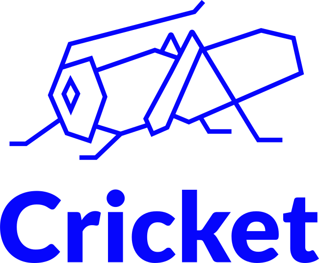

# Cricket HCMS documentation

{ width=33% style="display: block; margin: 0 auto"}

## Introduction

Cricket HCMS is a headless content management system that can be used to manage content presented by other services (such as websites or mobile apps).

Starting up, the service reads files from the configured disk folder and its subfolders and places them in its database. The database is continuously updated when changes are detected in the monitored file system.

The documents are made available via a REST API, with Markdown-formatted content auomatically translated into HTML.

## Features

- [x] Support for document sources from a Git repository or Wiki (e.g. GitHub wiki, Obsidian and others)
- [x] Markdown support
- [x] HTML support
- [x] Automatic translation of Markdown content into HTML
- [x] REST API for accessing content
- [x] Reloading content database upon changes detected on disk
- [x] Serving binary files

## Repository dependent features

- [x] content versioning provided by Git
- [x] support for multiple languages possible by organizing the document structure

## Documentation

- [Building](building.md)
- [Running](running.md)
- [Running with Docker Compose](running-with-docker-compose.md)
- [Content publishing](publishing.md)
